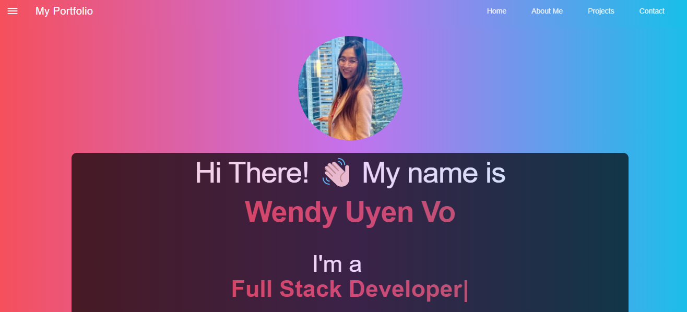

# react-portfolio

# Employee Directory
  
  

## Description
My portfolio has been upgraded by using React JS and the front end framework get Material Design Lite.

## Table of Contents
- [Description](#description)
- [Installation](#installation)
- [Technology](#technology)
- [Link to GitHub](#linktogithub)
- [Screenshots](#screenshots)
- [License](#license)
- [Contributing](#contributing)
- [Questions](#questions)

## Installation
- To create a react app, run:
npx create-react-app my-app

- In order to run the application, use:
npm start

## Technology 

- Node.js
- React
- React Material Design Lite : react-mdl

## Link to GitHub:
[GitHub](https://github.com/wendyVo/react-portfolio.git)

## Link to Deployed Applicaion:

[DemoLink](https://wendy-portfolio-0621.herokuapp.com/)

## Screenshots:
- HomePage
 

## License

 
This application is covered under  license. 

## Contributing
Contributors: Wendy Vo  
Please read this [Setting guidelines for repository contributors](https://docs.github.com/en/github/building-a-strong-community/setting-guidelines-for-repository-contributors) for more informations.

## Questions

Please contact me should you have any questions:  
:email:   Email: uyen199247@gmail.com  
:octocat: GitHub:  [wendyVo](https://github.com/wendyVo)

